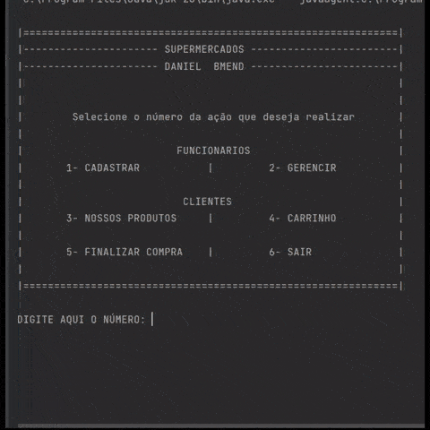
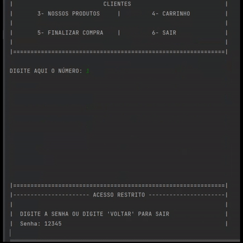
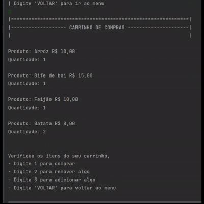

# mercadoJava 
## Description
Nesse projeto trabalhei com Java orientado a objetos, com estruturas de repetição, conjuntos, listas, estruturas if, tratamentos de excessões, entre outros.

ESSE PROJETO FOI FEITO 100% NO CONSOLE DA IDE, o foco principal é que recrutadores e desenvolvedores da área possam ver meus conhecimentos em Java e minha habilidade em criar varios cenarios e resolver seus probelmas! E não esse não é um texto genérico kkkkkkkk.

No mercado temos 2 áreas (Funcionarios e Clientes); Funcionarios tem acesso a area de CADASTRAR novos produtos ao mercado e uma outra para GERENCIAR ( Remover / Ver / Adicionar ), sempre para acessarem essas áreas será pedida a senha (12345), eu apresento ela no console para que possam explorar essas duas áreas. .
Clientes tem acesso a área de PRODUTOS para ver os que estão disponíveis e adiciona-los ao carrinho, também tem a área de CARRINHO para verem seus produtos e manusea-los (Comprar, Remover, Adicionar), existe também a área de FINALIZAR as compras, em que também existem várias opções do que fazer dentro dela. . TODOS tem acesso a área de saída que ao seleciona-la você vai para a tela de despedida com uma breve descrição e o programa se encerra automaticamente.

## Apenas alguns gifs do projeto
Caso queira ver mais sobre o projeto gravei outras telas na pasta src/projectClips ou você também pode baixar o código e explorar você mesmo!
 
 
 

 

 

## About Me
Olá, meu nome é Daniel Bastos Mendonça, mas conhecido como Daniel Bmend.

Esse é um dos meus muitos projetos que desenvolvo no meu github, são projeto apenas para estudo e para portfólio para vagas na área de desenvolvedor esse em especifico destino a área de Java, um projeto simples, mas fico muito feliz por ter feito ele inteiro.
